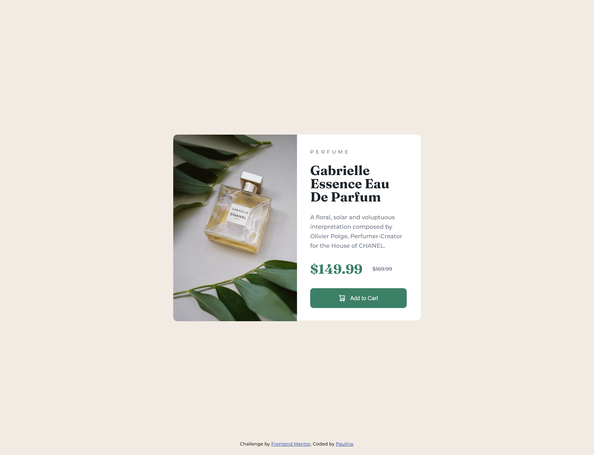

# Frontend Mentor - Product preview card component

This is my own solution to the [Product preview card component challenge on Frontend Mentor](https://www.frontendmentor.io/challenges/product-preview-card-component-GO7UmttRfa). Frontend Mentor challenges help improve coding skills by building realistic projects. 

## Table of contents

- [Overview](#overview)
  - [The challenge](#the-challenge)
  - [Screenshot](#screenshot)
  - [Links](#links)
- [My process](#my-process)
  - [Built with](#built-with)
- [Author](#author)

## Overview

### The challenge

Users should be able to:

- View the optimal layout depending on their device's screen size
- See hover and focus states for interactive elements

### Screenshot

### Links

- Live Site URL: [Product Preview Card](https://testerium-product-preview-card.netlify.app/)

## My process

It took me 1 hour to complete this project. The project is suitable for desktop and mobile views. I did not have any difficulties during implementation.

### Built with

- HTML
- CSS 
- SCSS
- Flexbox
- Grid

## Author

- Frontend Mentor - [@testerium](https://www.frontendmentor.io/profile/testerium)